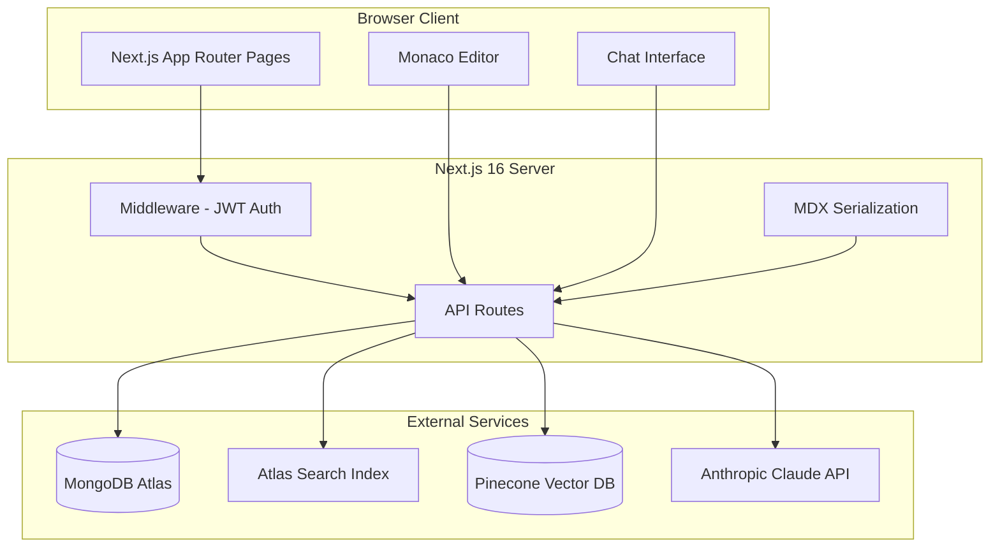
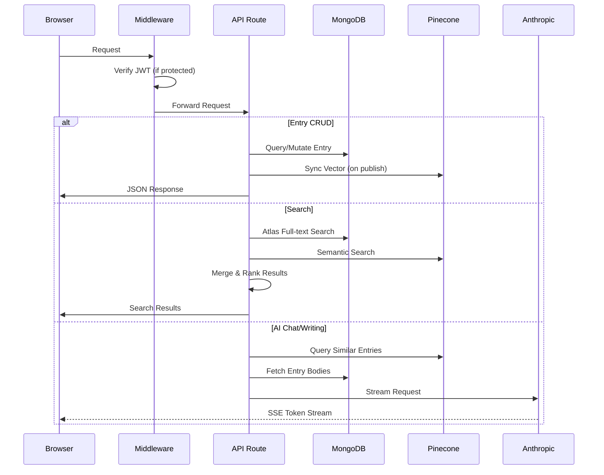

# Design Document

## Overview

This design document describes the technical architecture for a personal knowledgebase web application that replaces a flat-file MDX repository with a full-featured Next.js 16 application. The system provides:

- **Content Management**: CRUD operations for MDX-based knowledge entries with MongoDB Atlas storage and Pinecone vector synchronization
- **Hybrid Search**: Combined Atlas full-text and Pinecone semantic search with weighted score merging
- **AI Features**: RAG-powered chat and writing assistance with configurable agent personas
- **MDX Editing**: Monaco-based editor with live preview and AI assistance panel
- **Admin Tools**: Dashboard for statistics, activity monitoring, and runtime agent configuration

The application uses a single-admin authentication model with JWT tokens, supports dark/light theming (dark default), and deploys to Vercel with Fluid Compute for extended streaming timeouts.

## Architecture

### System Architecture Diagram



### Request Flow



### Key Architectural Decisions

1. **Dedicated Category Collection**: Hierarchical taxonomy stored in a separate collection with parentId references, enabling efficient tree queries and explicit ordering. Entries reference categories by ID rather than storing path strings.

2. **Dual Search Strategy**: Atlas Search for keyword/phrase matching with field boosting; Pinecone for semantic similarity. Results merged with 50/50 weighting.

3. **Singleton WritingConfig**: Agent configuration stored as a single upserted document, enabling runtime tuning without redeployment.

4. **SSE Streaming for AI**: Server-Sent Events for real-time token streaming from Anthropic API, with Vercel Fluid Compute enabling 300s+ timeouts.

5. **Frontmatter Separation**: Editor manages frontmatter via form fields, not inline YAML. Serialized to YAML only on save.

## Components and Interfaces

### API Route Interfaces

#### Authentication API

```typescript
// POST /api/auth/login
interface LoginRequest {
  username: string;
  password: string;
}
interface LoginResponse {
  ok: true;
} // Sets HTTP-only cookie

// POST /api/auth/logout
interface LogoutResponse {
  ok: true;
} // Clears cookie
```

#### Entries API

```typescript
// GET /api/entries
interface EntriesListParams {
  categoryId?: string;
  tag?: string;
  language?: string;
  status?: "draft" | "published";
  page?: number;
  limit?: number;
  sort?: string;
}
interface EntriesListResponse {
  entries: Omit<IEntry, "body">[];
  total: number;
  page: number;
  pages: number;
}

// POST /api/entries
interface CreateEntryRequest {
  slug?: string; // Auto-generated if not provided
  categoryId: string; // Required - reference to Category
  status?: "draft" | "published"; // Defaults to 'draft'
  frontmatter: EntryFrontmatter;
  body: string;
}
interface CreateEntryResponse {
  entry: IEntry;
}

// GET /api/entries/[id]
interface GetEntryResponse {
  entry: IEntry;
}

// PUT /api/entries/[id]
interface UpdateEntryRequest {
  slug?: string;
  categoryId?: string;
  status?: "draft" | "published";
  frontmatter?: Partial<EntryFrontmatter>;
  body?: string;
}
interface UpdateEntryResponse {
  entry: IEntry;
}

// DELETE /api/entries/[id]
interface DeleteEntryResponse {
  ok: true;
}
```

#### Categories API

```typescript
// GET /api/categories
interface CategoriesListResponse {
  categories: ICategory[];
}

// GET /api/categories/tree
interface CategoryTreeResponse {
  tree: CategoryTreeNode[];
}
interface CategoryTreeNode {
  _id: string;
  name: string;
  slug: string;
  order: number;
  entryCount: number;
  children: CategoryTreeNode[];
}

// POST /api/categories
interface CreateCategoryRequest {
  name: string;
  slug?: string; // Auto-generated if not provided
  parentId?: string | null; // null = root category
  order?: number;
  description?: string;
}
interface CreateCategoryResponse {
  category: ICategory;
}

// GET /api/categories/[id]
interface GetCategoryResponse {
  category: ICategory;
}

// PUT /api/categories/[id]
interface UpdateCategoryRequest {
  name?: string;
  slug?: string;
  parentId?: string | null;
  order?: number;
  description?: string;
}
interface UpdateCategoryResponse {
  category: ICategory;
}

// DELETE /api/categories/[id]
interface DeleteCategoryResponse {
  ok: true;
}
// Returns 409 Conflict if entries reference this category
```

#### Search API

```typescript
// GET /api/search
interface SearchParams {
  q: string;
  mode?: "hybrid" | "atlas" | "pinecone";
  tags?: string[];
  topics?: string[];
  languages?: string[];
  limit?: number;
}
interface SearchResult {
  entry: Omit<IEntry, "body">;
  score: number;
  source: "atlas" | "pinecone" | "both";
  excerpt?: string;
}
interface SearchResponse {
  results: SearchResult[];
  total: number;
}
```

#### Preview API

```typescript
// POST /api/preview
interface PreviewRequest {
  mdx: string;
}
interface PreviewResponse {
  serialized: MDXRemoteSerializeResult;
}
```

#### Chat API

```typescript
// POST /api/chat (SSE stream)
interface ChatRequest {
  messages: Array<{ role: "user" | "assistant"; content: string }>;
}
// SSE events:
// data: { delta: string }
// data: { done: true, sources: Array<{ id: string; title: string; slug: string; categoryPath: string }> }
```

#### Writing Agent API

```typescript
// POST /api/ai/writing-agent (SSE stream)
interface WritingAgentRequest {
  action:
    | "review"
    | "improve"
    | "expand"
    | "suggest-title"
    | "suggest-tags"
    | "research"
    | "draft"
    | "qa-review";
  persona?: "researcher" | "writer" | "reviewer";
  body: string;
  frontmatter: EntryFrontmatter;
  selection?: string;
  context?: string;
}
// SSE events:
// data: { delta: string }
// data: { done: true, artifactType?: 'research-report' | 'draft' | 'qa-findings' }
```

#### Admin API

```typescript
// GET /api/admin/stats
interface AdminStatsResponse {
  totalEntries: number;
  totalTopics: number;
  totalTags: number;
  needsHelpCount: number;
  recentlyCreated: Array<{ id: string; title: string; createdAt: Date }>;
  recentlyUpdated: Array<{ id: string; title: string; updatedAt: Date }>;
  topTags: Array<{ tag: string; count: number }>;
  topTopics: Array<{ topic: string; count: number }>;
  skillLevelDistribution: Record<1 | 2 | 3 | 4 | 5, number>;
}

// GET /api/admin/writing-config
interface GetWritingConfigResponse {
  config: WritingConfig;
}

// PUT /api/admin/writing-config
interface UpdateWritingConfigRequest {
  config: Partial<WritingConfig>;
}
interface UpdateWritingConfigResponse {
  config: WritingConfig;
}
```

#### Tags API

```typescript
// GET /api/tags
interface TagsResponse {
  tags: string[];
  topics: string[];
  languages: string[];
}
```

### Component Hierarchy

```
App Layout
├── ThemeProvider
├── AuthProvider
├── TopNav
│   ├── Logo/Home Link
│   ├── Navigation Links
│   └── ThemeToggle
└── Page Content
    ├── /browse
    │   ├── CategoryTree (sidebar)
    │   ├── SearchBar
    │   ├── TagFilter
    │   └── EntryCard[] / EntryDetail
    ├── /chat
    │   └── ChatInterface
    │       ├── MessageList
    │       │   └── MessageBubble[]
    │       ├── ChatInput
    │       └── SourceCitations
    ├── /entries/new, /entries/[id]/edit
    │   └── EntryEditor
    │       ├── TopBar (slug, status toggle, save)
    │       ├── SplitLayout
    │       │   ├── FrontmatterForm
    │       │   │   └── CategoryPicker
    │       │   ├── MonacoPane
    │       │   └── PreviewPane
    │       └── AIWritingPanel
    └── /admin
        ├── StatsPanel
        ├── RecentEntries
        ├── TopTagsChart
        ├── CategoryManager
        └── WritingConfigEditor
            ├── AgentPersonaForm
            ├── SkillsManager
            └── TemplatesManager
```

### Key Component Interfaces

```typescript
// EntryEditor Props
interface EntryEditorProps {
  entry?: IEntry; // undefined for new entries
  categories: CategoryTreeNode[]; // For CategoryPicker
  onSave: (entry: IEntry) => Promise<void>;
  onDelete?: () => Promise<void>;
}

// CategoryTree Props (browse sidebar)
interface CategoryTreeProps {
  tree: CategoryTreeNode[];
  selectedCategoryId?: string;
  onSelect: (categoryId: string) => void;
}

// CategoryPicker Props (editor form)
interface CategoryPickerProps {
  tree: CategoryTreeNode[];
  selectedCategoryId?: string;
  onChange: (categoryId: string) => void;
  onCreateCategory?: (
    name: string,
    parentId: string | null,
  ) => Promise<ICategory>;
}

// CategoryManager Props (admin)
interface CategoryManagerProps {
  tree: CategoryTreeNode[];
  onCreateCategory: (data: CreateCategoryRequest) => Promise<ICategory>;
  onUpdateCategory: (
    id: string,
    data: UpdateCategoryRequest,
  ) => Promise<ICategory>;
  onDeleteCategory: (id: string) => Promise<void>;
  onReorderCategories: (categoryId: string, newOrder: number) => Promise<void>;
}

// ChatInterface Props
interface ChatInterfaceProps {
  initialMessages?: ChatMessage[];
}

// AIWritingPanel Props
interface AIWritingPanelProps {
  body: string;
  frontmatter: EntryFrontmatter;
  selection?: string;
  onApply: (content: string) => void;
}

// WritingConfigEditor Props
interface WritingConfigEditorProps {
  config: WritingConfig;
  onSave: (config: Partial<WritingConfig>) => Promise<void>;
}
```

## Data Models

### Category Model (MongoDB/Mongoose)

```typescript
// src/types/category.ts
interface ICategory {
  _id: string;
  slug: string; // URL segment, unique within parent
  name: string; // Display name
  parentId: string | null; // null = root category
  order: number; // Sort order within parent (0-indexed)
  description?: string; // Optional category description
  createdAt: Date;
  updatedAt: Date;
}
```

### Mongoose Schema for Category

```typescript
// src/lib/db/models/Category.ts
const CategorySchema = new Schema<ICategory>(
  {
    slug: { type: String, required: true },
    name: { type: String, required: true },
    parentId: {
      type: Schema.Types.ObjectId,
      ref: "Category",
      default: null,
      index: true,
    },
    order: { type: Number, default: 0, index: true },
    description: { type: String },
  },
  { timestamps: true },
);

// Compound unique index: slug must be unique within the same parent
CategorySchema.index({ parentId: 1, slug: 1 }, { unique: true });

// Static method to get full tree
CategorySchema.statics.getTree = async function (): Promise<
  CategoryTreeNode[]
> {
  const categories = await this.find().sort({ order: 1 }).lean();
  return buildTree(categories);
};

// Static method to get category path (for breadcrumbs)
CategorySchema.statics.getPath = async function (
  categoryId: string,
): Promise<ICategory[]> {
  const path: ICategory[] = [];
  let current = await this.findById(categoryId);
  while (current) {
    path.unshift(current);
    current = current.parentId ? await this.findById(current.parentId) : null;
  }
  return path;
};
```

### Entry Model (MongoDB/Mongoose)

```typescript
// src/types/entry.ts
interface Resource {
  title: string;
  linkUrl: string;
}

interface EntryFrontmatter {
  title: string;
  topics: string[]; // e.g. ["bash", "search"] - freeform topic tags
  tags: string[]; // freeform tags
  languages: string[]; // e.g. ["javascript", "bash"]
  skillLevel: 1 | 2 | 3 | 4 | 5;
  needsHelp: boolean;
  isPrivate: boolean; // hidden from unauthenticated views
  resources: Resource[];
  relatedEntries: string[]; // ObjectId refs
}

interface IEntry {
  _id: string;
  slug: string; // unique, URL-safe
  categoryId: string; // Reference to Category collection
  status: "draft" | "published";
  frontmatter: EntryFrontmatter;
  body: string; // raw MDX (without frontmatter YAML)
  pineconeId: string;
  sourceFile?: string; // migration provenance
  createdAt: Date;
  updatedAt: Date;
}
```

### Mongoose Schema for Entry

```typescript
// src/lib/db/models/Entry.ts
const EntrySchema = new Schema<IEntry>(
  {
    slug: { type: String, required: true, unique: true },
    categoryId: {
      type: Schema.Types.ObjectId,
      ref: "Category",
      required: true,
      index: true,
    },
    status: {
      type: String,
      enum: ["draft", "published"],
      default: "draft",
      index: true,
    },
    frontmatter: {
      title: { type: String, required: true },
      topics: { type: [String], default: [], index: true },
      tags: { type: [String], default: [], index: true },
      languages: { type: [String], default: [], index: true },
      skillLevel: { type: Number, min: 1, max: 5, default: 3 },
      needsHelp: { type: Boolean, default: false },
      isPrivate: { type: Boolean, default: false, index: true },
      resources: [
        {
          title: String,
          linkUrl: String,
        },
      ],
      relatedEntries: [{ type: Schema.Types.ObjectId, ref: "Entry" }],
    },
    body: { type: String, required: true },
    pineconeId: { type: String },
    sourceFile: { type: String },
  },
  { timestamps: true },
);
```

### MongoDB Indexes

| Index | Fields | Purpose |
| --- | --- | --- |
| Unique slug (Entry) | `slug` | URL routing, uniqueness constraint |
| Category ref | `categoryId` | Category filtering, joins |
| Topics | `frontmatter.topics` | Topic filtering |
| Tags | `frontmatter.tags` | Tag filtering |
| Languages | `frontmatter.languages` | Language filtering |
| Status | `status` | Draft/published filtering |
| Privacy | `frontmatter.isPrivate` | Public-only queries |
| Category parent | `parentId` | Tree traversal queries |
| Category order | `order` | Sorted retrieval within parent |
| Category slug unique | `parentId, slug` (compound) | Slug uniqueness within same parent |

### Atlas Search Index Configuration

```json
{
  "name": "entry_search",
  "mappings": {
    "dynamic": false,
    "fields": {
      "frontmatter": {
        "type": "document",
        "fields": {
          "title": {
            "type": "string",
            "analyzer": "lucene.standard",
            "boost": 2
          },
          "topics": { "type": "stringFacet" },
          "tags": { "type": "stringFacet" },
          "languages": { "type": "stringFacet" }
        }
      },
      "body": {
        "type": "string",
        "analyzer": "lucene.standard"
      },
      "status": { "type": "stringFacet" },
      "topicPath": { "type": "string" }
    }
  }
}
```

### WritingConfig Model (MongoDB/Mongoose)

```typescript
// src/types/writing-config.ts
interface WritingSkill {
  id: string;
  name: string; // shown in editor panel button
  description: string; // tooltip / admin label
  prompt: string; // injected into agent context
}

interface WritingTemplate {
  id: string;
  name: string;
  description: string;
  body: string; // MDX template body
  frontmatter: Partial<EntryFrontmatter>; // pre-fills form
}

interface AgentPersona {
  role: "researcher" | "writer" | "reviewer";
  systemPrompt: string;
  enabled: boolean;
}

interface WritingConfig {
  _id: string;
  baseSystemPrompt: string;
  styleGuide: string; // markdown
  skills: WritingSkill[];
  templates: WritingTemplate[];
  agents: AgentPersona[];
  updatedAt: Date;
}
```

### Mongoose Schema for WritingConfig

```typescript
// src/lib/db/models/WritingConfig.ts
const WritingConfigSchema = new Schema<WritingConfig>(
  {
    baseSystemPrompt: { type: String, default: "" },
    styleGuide: { type: String, default: "" },
    skills: [
      {
        id: { type: String, required: true },
        name: { type: String, required: true },
        description: String,
        prompt: { type: String, required: true },
      },
    ],
    templates: [
      {
        id: { type: String, required: true },
        name: { type: String, required: true },
        description: String,
        body: { type: String, default: "" },
        frontmatter: { type: Schema.Types.Mixed, default: {} },
      },
    ],
    agents: [
      {
        role: {
          type: String,
          enum: ["researcher", "writer", "reviewer"],
          required: true,
        },
        systemPrompt: { type: String, default: "" },
        enabled: { type: Boolean, default: true },
      },
    ],
  },
  { timestamps: true },
);

// Singleton pattern: always upsert, never create multiple
WritingConfigSchema.statics.getConfig = async function () {
  let config = await this.findOne();
  if (!config) {
    config = await this.create({});
  }
  return config;
};
```

### Pinecone Vector Schema

```typescript
interface PineconeVector {
  id: string; // Entry._id.toString()
  values: number[]; // Embedding vector (dimension depends on model)
  metadata: {
    entryId: string;
    slug: string;
    title: string;
    categoryId: string;
    categoryPath: string; // Computed path for display, e.g. "software-engineering/ai/agents"
    topics: string[];
    tags: string[];
    languages: string[];
    status: string;
    isPrivate: boolean;
  };
}
```

### Category Tree Building Logic

```typescript
// src/lib/db/queries/categories.ts
interface CategoryTreeNode {
  _id: string;
  name: string;
  slug: string;
  order: number;
  entryCount: number;
  children: CategoryTreeNode[];
}

function buildTree(
  categories: ICategory[],
  entryCounts: Map<string, number>,
): CategoryTreeNode[] {
  const map = new Map<string, CategoryTreeNode>();
  const roots: CategoryTreeNode[] = [];

  // Create nodes
  for (const cat of categories) {
    map.set(cat._id.toString(), {
      _id: cat._id.toString(),
      name: cat.name,
      slug: cat.slug,
      order: cat.order,
      entryCount: entryCounts.get(cat._id.toString()) || 0,
      children: [],
    });
  }

  // Build hierarchy
  for (const cat of categories) {
    const node = map.get(cat._id.toString())!;
    if (cat.parentId) {
      const parent = map.get(cat.parentId.toString());
      if (parent) {
        parent.children.push(node);
      }
    } else {
      roots.push(node);
    }
  }

  // Sort children by order
  const sortChildren = (nodes: CategoryTreeNode[]) => {
    nodes.sort((a, b) => a.order - b.order);
    nodes.forEach((n) => sortChildren(n.children));
  };
  sortChildren(roots);

  return roots;
}

// Get full path string for a category (for breadcrumbs, Pinecone metadata)
async function getCategoryPath(categoryId: string): Promise<string> {
  const path = await Category.getPath(categoryId);
  return path.map((c) => c.slug).join("/");
}
```

### Search Result Merge Logic

```typescript
// src/lib/search/merge.ts
interface MergeConfig {
  atlasWeight: number; // 0.5
  pineconeWeight: number; // 0.5
}

function mergeSearchResults(
  atlasResults: AtlasResult[],
  pineconeResults: PineconeResult[],
  config: MergeConfig,
): SearchResult[] {
  // 1. Normalize Atlas scores to 0-1 range
  // 2. Combine scores for entries in both sources
  // 3. Apply weights
  // 4. Deduplicate by entry ID
  // 5. Sort by combined score descending
}
```

### Visibility Filter Logic

```typescript
// Applied to all entry queries based on auth state
function getVisibilityFilter(isAuthenticated: boolean): FilterQuery<IEntry> {
  if (isAuthenticated) {
    return {}; // No filter - admin sees everything
  }
  return {
    status: "published",
    "frontmatter.isPrivate": { $ne: true },
  };
}
```

## Correctness Properties

_A property is a characteristic or behavior that should hold true across all valid executions of a system—essentially, a formal statement about what the system should do. Properties serve as the bridge between human-readable specifications and machine-verifiable correctness guarantees._

### Property 1: Authentication Cookie Round-Trip

_For any_ valid username/password pair matching the stored credentials, submitting login should result in an HTTP-only JWT cookie being set, and subsequent requests with that cookie should be authenticated.

**Validates: Requirements 1.1, 1.3**

### Property 2: Invalid Credentials Rejection

_For any_ username/password pair that does not match the stored credentials, submitting login should return a 401 status code and no auth cookie should be set.

**Validates: Requirements 1.2**

### Property 3: Unauthenticated Access Protection

_For any_ protected route (pages or API endpoints) and any request without a valid auth cookie, the system should either redirect to login (for pages) or return 401 (for APIs).

**Validates: Requirements 1.4, 1.5, 9.6**

### Property 4: Entry Default Status on Creation

_For any_ new entry created without an explicit status field, the saved entry should have status 'draft'.

**Validates: Requirements 2.1**

### Property 5: Pinecone Sync Consistency

_For any_ entry, the following invariants should hold:

- If status is 'published', a vector with matching ID should exist in Pinecone
- If status is 'draft', no vector with that ID should exist in Pinecone
- After deletion, no vector with that ID should exist in Pinecone

**Validates: Requirements 2.2, 2.3, 2.4**

### Property 6: Slug URL-Safety

_For any_ entry title, the generated slug should contain only lowercase letters, numbers, and hyphens, with no leading/trailing hyphens or consecutive hyphens.

**Validates: Requirements 2.5**

### Property 7: Slug Uniqueness Invariant

_For any_ set of entries in the database, all slug values should be unique (no two entries share the same slug).

**Validates: Requirements 2.6**

### Property 8: Visibility Filter for Unauthenticated Users

_For any_ unauthenticated request to list entries, search, or directly access an entry:

- All returned entries should have status 'published' AND isPrivate should be false
- Direct requests to entries with status 'draft' OR isPrivate true should return 404

**Validates: Requirements 2.7, 2.9, 4.6, 13.1, 13.2, 13.5**

### Property 9: Authenticated User Full Visibility

_For any_ authenticated request to list entries or search, entries of all statuses (draft/published) and privacy settings (private/public) should be accessible and searchable.

**Validates: Requirements 2.8, 4.7, 13.4**

### Property 10: Public Entry Visibility

_For any_ entry with status 'published' and isPrivate false, it should be visible to both authenticated and unauthenticated users.

**Validates: Requirements 13.3**

### Property 11: Entry Filter Accuracy

_For any_ filter combination (categoryId, tag, language, status) applied to entry listing, all returned entries should match all specified filter criteria.

**Validates: Requirements 2.10**

### Property 12: Category Tree Structure

_For any_ set of categories, the Category Tree should organize categories hierarchically based on parentId references, with children sorted by order field.

**Validates: Requirements 3.1, 4.1**

### Property 12a: Category Slug Uniqueness Within Parent

_For any_ set of categories, no two categories with the same parentId should have the same slug.

**Validates: Requirements 3.6**

### Property 12b: Category Parent Validation

_For any_ category with a non-null parentId, the referenced parent category must exist in the database.

**Validates: Requirements 3.4**

### Property 12c: Category Deletion Protection

_For any_ category that has entries referencing it, deletion should be prevented (return 409 Conflict).

**Validates: Requirements 3.8**

### Property 12d: Entry Category Reference Validation

_For any_ entry being created or updated, the categoryId must reference an existing category.

**Validates: Requirements 2.11, 2.12**

### Property 13: Entry Metadata Display Completeness

_For any_ entry, the rendered detail view should contain the title, all topics, all tags, all languages, and the skill level from the frontmatter.

**Validates: Requirements 3.4**

### Property 14: Related Entries Display

_For any_ entry with non-empty relatedEntries array, the detail view should display links to all related entries.

**Validates: Requirements 3.5**

### Property 15: Resources Display

_For any_ entry with non-empty resources array, the detail view should display all resource titles and links.

**Validates: Requirements 3.6**

### Property 16: Breadcrumb Path Accuracy

_For any_ entry, the breadcrumb navigation should contain segments matching each category in the path from root to the entry's category.

**Validates: Requirements 4.7**

### Property 17: Search Score Merge Correctness

_For any_ search query returning results from both Atlas and Pinecone:

- Atlas scores should be normalized to 0-1 range
- Combined scores should weight Atlas at 50% and Pinecone at 50%
- Entries found in both sources should have higher combined scores than single-source matches

**Validates: Requirements 4.2, 4.3, 4.4**

### Property 18: Search Result Deduplication

_For any_ search query, the returned results should contain no duplicate entry IDs.

**Validates: Requirements 4.5**

### Property 19: Search Filter Accuracy

_For any_ search with tag, topic, or language filters applied, all returned results should match all specified filter criteria.

**Validates: Requirements 4.8**

### Property 20: Search Excerpt Presence

_For any_ search result, an excerpt field should be present containing text from the matched entry.

**Validates: Requirements 4.9**

### Property 21: Preview Debounce Behavior

_For any_ sequence of rapid editor changes within 600ms, only one preview serialization request should be triggered after the debounce period.

**Validates: Requirements 5.3**

### Property 22: MDX Serialization Round-Trip

_For any_ valid MDX string, serializing via the Preview_Service and then rendering should produce valid output without errors.

**Validates: Requirements 5.4**

### Property 23: Frontmatter YAML Round-Trip

_For any_ valid EntryFrontmatter object, serializing to YAML and parsing back should produce an equivalent object.

**Validates: Requirements 5.8**

### Property 24: Chat Context Token Limit

_For any_ entry body used as chat context, the truncated version should not exceed approximately 1500 tokens.

**Validates: Requirements 6.3**

### Property 25: Chat History Limit

_For any_ chat conversation, the prompt context should include at most the last 10 conversation turns.

**Validates: Requirements 6.4**

### Property 26: Chat Citation Completeness

_For any_ completed chat response, the source citations should include entry ID, title, slug, and category path for each cited source.

**Validates: Requirements 7.6**

### Property 27: Writing Agent Persona Support

_For any_ of the three persona values (researcher, writer, reviewer), the Writing_Agent should accept and process the request without error.

**Validates: Requirements 7.1**

### Property 28: Writing Agent Persona Selection

_For any_ Writing_Agent invocation with a specified persona, the system prompt used should match the AgentPersona.systemPrompt for that role from WritingConfig.

**Validates: Requirements 7.3**

### Property 29: Writing Agent Style Guide Injection

_For any_ Writing_Agent invocation, the assembled prompt context should contain the styleGuide content from WritingConfig.

**Validates: Requirements 7.6**

### Property 30: Writing Agent Skill Injection

_For any_ Writing_Agent invocation with a specified skill, the assembled prompt context should contain the skill's prompt from WritingConfig.

**Validates: Requirements 7.7**

### Property 31: Writing Agent Selection Context

_For any_ Writing_Agent invocation with a text selection provided, the selection text should be included in the prompt context.

**Validates: Requirements 7.12**

### Property 32: WritingConfig Singleton Invariant

_For any_ sequence of WritingConfig operations (create, update), there should be exactly one WritingConfig document in the database.

**Validates: Requirements 8.2**

### Property 33: WritingConfig CRUD Consistency

_For any_ add, edit, reorder, or delete operation on WritingSkill or WritingTemplate entries, the resulting WritingConfig should accurately reflect the operation.

**Validates: Requirements 8.5, 8.6**

### Property 34: Template Pre-fill Accuracy

_For any_ WritingTemplate selected for a new entry, the editor body should equal the template body and the frontmatter form should be populated with the template's frontmatter values.

**Validates: Requirements 8.7**

### Property 35: Admin Stats Accuracy

_For any_ set of entries in the database:

- totalEntries should equal the count of all entries
- totalTopics should equal the count of unique topics across all entries
- totalTags should equal the count of unique tags across all entries
- needsHelpCount should equal entries where needsHelp is true
- topTags/topTopics should be sorted by count descending
- skillLevelDistribution should match actual counts per level

**Validates: Requirements 9.1, 9.2, 9.4, 9.5**

### Property 36: Recent Entries Ordering

_For any_ set of entries, recentlyCreated should be sorted by createdAt descending and recentlyUpdated should be sorted by updatedAt descending.

**Validates: Requirements 9.3**

### Property 37: Migration Category Creation

_For any_ source file at path `base/dir1/dir2/filename.mdx`, the migration should create Category documents for `dir1` and `dir1/dir2` (if they don't exist) with proper parentId hierarchy.

**Validates: Requirements 11.2, 11.3**

### Property 38: Migration Slug Derivation

_For any_ source file, the slug should be taken from frontmatter.slug if present, otherwise derived from the filename (without extension).

**Validates: Requirements 11.4**

### Property 39: Migration Default Values

_For any_ source file with missing frontmatter fields, the migrated entry should have: skillLevel=3, needsHelp=false, isPrivate=false, empty arrays for topics/tags/languages/resources/relatedEntries.

**Validates: Requirements 11.5**

### Property 40: Migration Idempotency

_For any_ source file, running the migration script multiple times should not create duplicate entries (existing slugs should be skipped or updated).

**Validates: Requirements 11.6**

### Property 41: Migration Entry-Pinecone Sync

_For any_ migrated source file, an Entry document should exist in MongoDB with a corresponding vector in Pinecone, and the entry's pineconeId should reference that vector.

**Validates: Requirements 11.7, 11.8, 11.9**

### Property 42: Migration Default Published Status

_For any_ migrated entry, the status should be 'published'.

**Validates: Requirements 11.10**

### Property 43: Migration AI Agent Files Topic

_For any_ source file in the ai-agents directory, the migrated entry's topics should include "ai-agents".

**Validates: Requirements 11.11**

### Property 44: Theme Preference Round-Trip

_For any_ theme toggle action, the preference should be persisted to localStorage, and on page reload the theme should match the stored preference.

**Validates: Requirements 11.4**

### Property 45: Tag/Topic/Language Aggregation Accuracy

_For any_ set of entries, the /api/tags endpoint should return:

- tags: all unique values from frontmatter.tags across all entries
- topics: all unique values from frontmatter.topics across all entries
- languages: all unique values from frontmatter.languages across all entries

**Validates: Requirements 12.1, 12.2, 12.3**

### Property 46: DDS Component Mapping

_For any_ DDS component (Callout, Card, CodeBlock, etc.) used in MDX content, the component should render without errors.

**Validates: Requirements 14.2**

### Property 47: CodePlayground Embed Support

_For any_ CodePlayground component with a URL from CodeSandbox, JSFiddle, or CodePen, an iframe should be rendered with the correct src attribute.

**Validates: Requirements 14.4**

### Property 48: Stream Completion Event

_For any_ completed SSE stream from Chat_Service or Writing_Agent, a done event should be emitted containing the done:true flag and any associated metadata.

**Validates: Requirements 15.4**

## Error Handling

### API Error Response Format

All API routes return consistent error responses:

```typescript
interface ApiError {
  error: string; // Human-readable error message
  code?: string; // Machine-readable error code
  details?: unknown; // Additional context (validation errors, etc.)
}
```

### HTTP Status Codes

| Status | Usage                                           |
| ------ | ----------------------------------------------- |
| 200    | Successful GET, PUT                             |
| 201    | Successful POST (resource created)              |
| 400    | Bad Request - Invalid input, validation failure |
| 401    | Unauthorized - Missing or invalid auth token    |
| 404    | Not Found - Resource doesn't exist or is hidden |
| 409    | Conflict - Duplicate slug                       |
| 500    | Internal Server Error - Unexpected failures     |

### Error Handling by Layer

#### API Routes

```typescript
// Wrapper for consistent error handling
async function withErrorHandling(
  handler: () => Promise<Response>,
): Promise<Response> {
  try {
    return await handler();
  } catch (error) {
    if (error instanceof ValidationError) {
      return NextResponse.json(
        { error: error.message, details: error.details },
        { status: 400 },
      );
    }
    if (error instanceof NotFoundError) {
      return NextResponse.json({ error: "Not found" }, { status: 404 });
    }
    console.error("Unhandled error:", error);
    return NextResponse.json(
      { error: "Internal server error" },
      { status: 500 },
    );
  }
}
```

#### Database Operations

- Connection failures: Retry with exponential backoff (3 attempts)
- Duplicate key errors: Convert to 409 Conflict with descriptive message
- Validation errors: Convert to 400 Bad Request with field-level details

#### External Service Failures

| Service   | Failure Mode | Handling                                         |
| --------- | ------------ | ------------------------------------------------ |
| Pinecone  | Upsert fails | Log error, continue (entry saved without vector) |
| Pinecone  | Query fails  | Fall back to Atlas-only search                   |
| Anthropic | Stream error | Emit error event to client, close stream         |
| Anthropic | Rate limit   | Return 429 with retry-after header               |

#### MDX Serialization

- Invalid MDX syntax: Return 400 with parse error location
- Missing components: Render placeholder with warning
- Shiki highlighting failure: Fall back to plain code block

### Client-Side Error Handling

#### React Error Boundaries

```typescript
// Wrap major page sections
<ErrorBoundary fallback={<ErrorFallback />}>
  <EntryDetail entry={entry} />
</ErrorBoundary>
```

#### API Call Error Handling

```typescript
// Custom hook pattern
function useApiCall<T>(fetcher: () => Promise<T>) {
  const [data, setData] = useState<T | null>(null);
  const [error, setError] = useState<Error | null>(null);
  const [loading, setLoading] = useState(false);
  // ... implementation
}
```

#### SSE Stream Error Handling

```typescript
// Handle stream errors gracefully
eventSource.onerror = (event) => {
  setError("Connection lost. Please try again.");
  eventSource.close();
};
```

### Validation Rules

#### Entry Validation

| Field                           | Rules                                      |
| ------------------------------- | ------------------------------------------ |
| slug                            | Required, URL-safe characters only, unique |
| categoryId                      | Required, must reference existing Category |
| frontmatter.title               | Required, 1-200 characters                 |
| frontmatter.skillLevel          | Integer 1-5                                |
| frontmatter.resources[].linkUrl | Valid URL format                           |
| body                            | Required, non-empty                        |

#### Category Validation

| Field    | Rules                                                    |
| -------- | -------------------------------------------------------- |
| slug     | Required, URL-safe characters only, unique within parent |
| name     | Required, 1-100 characters                               |
| parentId | If provided, must reference existing Category            |
| order    | Non-negative integer                                     |

#### WritingConfig Validation

| Field           | Rules                                         |
| --------------- | --------------------------------------------- |
| skills[].id     | Required, unique within array                 |
| skills[].name   | Required, 1-50 characters                     |
| skills[].prompt | Required, non-empty                           |
| templates[].id  | Required, unique within array                 |
| agents[].role   | Must be 'researcher', 'writer', or 'reviewer' |

## Testing Strategy

### Dual Testing Approach

This project uses both unit tests and property-based tests for comprehensive coverage:

- **Unit tests**: Verify specific examples, edge cases, integration points, and error conditions
- **Property tests**: Verify universal properties across randomized inputs

Both approaches are complementary—unit tests catch concrete bugs while property tests verify general correctness across the input space.

### Property-Based Testing Configuration

**Library**: fast-check (JavaScript/TypeScript property-based testing library)

**Configuration**:

- Minimum 100 iterations per property test
- Each property test must reference its design document property via comment tag
- Tag format: `// Feature: knowledgebase-app, Property {number}: {property_text}`

### Test Organization

```
tests/
├── unit/
│   ├── lib/
│   │   ├── auth/
│   │   │   ├── jwt.test.ts
│   │   │   └── password.test.ts
│   │   ├── db/
│   │   │   ├── models/Entry.test.ts
│   │   │   ├── models/Category.test.ts
│   │   │   ├── queries/entries.test.ts
│   │   │   └── queries/categories.test.ts
│   │   ├── search/
│   │   │   └── merge.test.ts
│   │   ├── mdx/
│   │   │   └── serialize.test.ts
│   │   └── ai/
│   │       ├── chat.test.ts
│   │       └── writing-agent.test.ts
│   ├── api/
│   │   ├── entries.test.ts
│   │   ├── categories.test.ts
│   │   ├── search.test.ts
│   │   ├── auth.test.ts
│   │   └── admin.test.ts
│   └── components/
│       ├── CategoryTree.test.tsx
│       ├── CategoryPicker.test.tsx
│       ├── CategoryManager.test.tsx
│       ├── EntryEditor.test.tsx
│       └── ChatInterface.test.tsx
├── property/
│   ├── entry-visibility.property.ts
│   ├── category-hierarchy.property.ts
│   ├── search-merge.property.ts
│   ├── slug-generation.property.ts
│   ├── frontmatter-serialization.property.ts
│   ├── migration.property.ts
│   └── aggregation.property.ts
└── integration/
    ├── entry-crud.integration.ts
    ├── category-crud.integration.ts
    ├── search-flow.integration.ts
    └── chat-flow.integration.ts
```

### Property Test Examples

```typescript
// tests/property/entry-visibility.property.ts
import fc from "fast-check";
import { getVisibilityFilter } from "@/lib/db/queries/entries";

describe("Entry Visibility Properties", () => {
  // Feature: knowledgebase-app, Property 8: Visibility Filter for Unauthenticated Users
  it("should filter out drafts and private entries for unauthenticated users", () => {
    fc.assert(
      fc.property(
        fc.record({
          status: fc.constantFrom("draft", "published"),
          isPrivate: fc.boolean(),
        }),
        (entry) => {
          const filter = getVisibilityFilter(false);
          const matches = matchesFilter(entry, filter);

          if (entry.status === "draft" || entry.isPrivate) {
            return matches === false;
          }
          return matches === true;
        },
      ),
      { numRuns: 100 },
    );
  });

  // Feature: knowledgebase-app, Property 9: Authenticated User Full Visibility
  it("should return all entries for authenticated users", () => {
    fc.assert(
      fc.property(
        fc.record({
          status: fc.constantFrom("draft", "published"),
          isPrivate: fc.boolean(),
        }),
        (entry) => {
          const filter = getVisibilityFilter(true);
          return matchesFilter(entry, filter) === true;
        },
      ),
      { numRuns: 100 },
    );
  });
});
```

```typescript
// tests/property/slug-generation.property.ts
import fc from "fast-check";
import { generateSlug } from "@/lib/utils/slug";

describe("Slug Generation Properties", () => {
  // Feature: knowledgebase-app, Property 6: Slug URL-Safety
  it("should generate URL-safe slugs", () => {
    fc.assert(
      fc.property(fc.string({ minLength: 1, maxLength: 200 }), (title) => {
        const slug = generateSlug(title);
        // Only lowercase letters, numbers, hyphens
        const isUrlSafe = /^[a-z0-9]+(-[a-z0-9]+)*$/.test(slug) || slug === "";
        return isUrlSafe;
      }),
      { numRuns: 100 },
    );
  });
});
```

```typescript
// tests/property/search-merge.property.ts
import fc from "fast-check";
import { mergeSearchResults } from "@/lib/search/merge";

describe("Search Merge Properties", () => {
  // Feature: knowledgebase-app, Property 17: Search Score Merge Correctness
  it("should rank dual-source matches higher than single-source", () => {
    fc.assert(
      fc.property(
        fc.array(
          fc.record({
            id: fc.uuid(),
            score: fc.float({ min: 0, max: 1 }),
          }),
          { minLength: 1 },
        ),
        fc.array(
          fc.record({
            id: fc.uuid(),
            score: fc.float({ min: 0, max: 1 }),
          }),
          { minLength: 1 },
        ),
        (atlasResults, pineconeResults) => {
          const merged = mergeSearchResults(atlasResults, pineconeResults, {
            atlasWeight: 0.5,
            pineconeWeight: 0.5,
          });

          const dualSource = merged.filter((r) => r.source === "both");
          const singleSource = merged.filter((r) => r.source !== "both");

          if (dualSource.length > 0 && singleSource.length > 0) {
            const minDualScore = Math.min(...dualSource.map((r) => r.score));
            const maxSingleScore = Math.max(
              ...singleSource.map((r) => r.score),
            );
            return minDualScore >= maxSingleScore;
          }
          return true;
        },
      ),
      { numRuns: 100 },
    );
  });

  // Feature: knowledgebase-app, Property 18: Search Result Deduplication
  it("should return no duplicate entry IDs", () => {
    fc.assert(
      fc.property(
        fc.array(fc.record({ id: fc.uuid(), score: fc.float() })),
        fc.array(fc.record({ id: fc.uuid(), score: fc.float() })),
        (atlasResults, pineconeResults) => {
          const merged = mergeSearchResults(atlasResults, pineconeResults, {
            atlasWeight: 0.5,
            pineconeWeight: 0.5,
          });

          const ids = merged.map((r) => r.id);
          const uniqueIds = new Set(ids);
          return ids.length === uniqueIds.size;
        },
      ),
      { numRuns: 100 },
    );
  });
});
```

```typescript
// tests/property/frontmatter-serialization.property.ts
import fc from "fast-check";
import { serializeFrontmatter, parseFrontmatter } from "@/lib/mdx/frontmatter";

describe("Frontmatter Serialization Properties", () => {
  // Feature: knowledgebase-app, Property 23: Frontmatter YAML Round-Trip
  it("should round-trip frontmatter through YAML", () => {
    const frontmatterArb = fc.record({
      title: fc.string({ minLength: 1, maxLength: 200 }),
      topics: fc.array(fc.string({ minLength: 1 })),
      tags: fc.array(fc.string({ minLength: 1 })),
      languages: fc.array(fc.string({ minLength: 1 })),
      skillLevel: fc.integer({ min: 1, max: 5 }),
      needsHelp: fc.boolean(),
      isPrivate: fc.boolean(),
      resources: fc.array(
        fc.record({
          title: fc.string(),
          linkUrl: fc.webUrl(),
        }),
      ),
      relatedEntries: fc.array(fc.uuid()),
    });

    fc.assert(
      fc.property(frontmatterArb, (frontmatter) => {
        const yaml = serializeFrontmatter(frontmatter);
        const parsed = parseFrontmatter(yaml);
        return deepEqual(frontmatter, parsed);
      }),
      { numRuns: 100 },
    );
  });
});
```

### Unit Test Focus Areas

Unit tests should focus on:

1. **Specific examples demonstrating correct behavior**
   - Login with known valid/invalid credentials
   - Entry creation with specific frontmatter values
   - Search with known query and expected results

2. **Edge cases**
   - Empty arrays for topics/tags/languages
   - Maximum length titles
   - Special characters in content
   - Concurrent operations

3. **Error conditions**
   - Database connection failures
   - Invalid MDX syntax
   - Missing required fields
   - Duplicate slugs

4. **Integration points**
   - MongoDB ↔ Pinecone sync
   - Anthropic API streaming
   - MDX serialization ↔ rendering

### Test Data Generators

```typescript
// tests/generators/entry.ts
import fc from "fast-check";

export const entryFrontmatterArb = fc.record({
  title: fc.string({ minLength: 1, maxLength: 200 }),
  topics: fc.array(fc.string({ minLength: 1, maxLength: 50 }), {
    maxLength: 10,
  }),
  tags: fc.array(fc.string({ minLength: 1, maxLength: 50 }), { maxLength: 20 }),
  languages: fc.array(
    fc.constantFrom("javascript", "typescript", "python", "bash", "go", "rust"),
  ),
  skillLevel: fc.integer({ min: 1, max: 5 }) as fc.Arbitrary<1 | 2 | 3 | 4 | 5>,
  needsHelp: fc.boolean(),
  isPrivate: fc.boolean(),
  resources: fc.array(
    fc.record({
      title: fc.string({ minLength: 1 }),
      linkUrl: fc.webUrl(),
    }),
    { maxLength: 5 },
  ),
  relatedEntries: fc.array(fc.uuid(), { maxLength: 5 }),
});

export const entryArb = fc.record({
  slug: fc
    .string({ minLength: 1, maxLength: 100 })
    .map((s) => s.toLowerCase().replace(/[^a-z0-9]/g, "-")),
  categoryId: fc.uuid(),
  status: fc.constantFrom("draft", "published") as fc.Arbitrary<
    "draft" | "published"
  >,
  frontmatter: entryFrontmatterArb,
  body: fc.string({ minLength: 1, maxLength: 10000 }),
});

export const categoryArb = fc.record({
  slug: fc
    .string({ minLength: 1, maxLength: 50 })
    .map((s) => s.toLowerCase().replace(/[^a-z0-9]/g, "-")),
  name: fc.string({ minLength: 1, maxLength: 100 }),
  parentId: fc.option(fc.uuid(), { nil: null }),
  order: fc.nat({ max: 100 }),
  description: fc.option(fc.string({ maxLength: 500 })),
});
```

### CI/CD Integration

```yaml
# .github/workflows/test.yml
name: Tests
on: [push, pull_request]
jobs:
  test:
    runs-on: ubuntu-latest
    steps:
      - uses: actions/checkout@v4
      - uses: actions/setup-node@v4
        with:
          node-version: "20"
      - run: npm ci
      - run: npm run test:unit
      - run: npm run test:property
      - run: npm run test:integration
        env:
          MONGODB_URI: ${{ secrets.TEST_MONGODB_URI }}
          PINECONE_API_KEY: ${{ secrets.TEST_PINECONE_API_KEY }}
```
